  

  
  
  

 

  
  
  

---

## 👨‍💻 Sobre Mí

Soy **John Alexander Páez Arias**, Specialist en Sistemas Inteligentes y Desarrollador Full Stack con enfoque en **IA Agentic**. Con más de 3 años de experiencia, construyo soluciones que cierran la brecha entre la IA avanzada y la operatividad empresarial (Logística, Agro y Educación).

### 🎯 Enfoque Actual
*   🧠 **Agentes de IA & Sistemas Autónomos**: Desarrollo con LangChain y LangGraph.
*   ⚙️ **Automatización Inteligente**: Flujos de trabajo con n8n y arquitecturas sin servidor.
*   🚀 **Software con IA**: Integración de LLMs (Gemini, GPT) en productos digitales escalables.

---

## 🚀 Dashboard Tecnológico

| 🧠 IA & AGENTIC | 🌐 FULL STACK | 🛠️ DEVOPS & CLOUD |
| :--- | :--- | :--- |
| **Frameworks**: LangChain, LangGraph | **Runtime**: Node.js, Bun | **Infra**: Docker, Kubernetes |
| **LLMs**: Gemini SDK, OpenAI API | **Front**: React, Next.js, Vite | **Cloud**: Google Cloud, AWS |
| **Tools**: n8n, Flowise, Vector DBs | **Backend**: TypeScript, Elysia.js, Python | **DBs**: PostgreSQL, MongoDB |

---

## 🎥 Tu Profe de IA
Creador de contenido en **[YouTube](https://www.youtube.com/@tuprofedeIA)**, simplificando la IA para emprendedores y desarrolladores.

  
<b>📅 En vivos (Hora Colombia GMT-5)</b>

  
Lunes: Creación de Contenido | Miércoles y Viernes: IA aplicada a negocios

---

## 🌟 Proyectos Destacados

<table width="100%">
  <tr>
    <td width="50%">
      <b>🤖 <a href="https://github.com/johpaz/whatsapp-gemini-agent">whatsapp-gemini-agent</a></b> 
      Asistente inteligente para WhatsApp con Gemini SDK.
    </td>
    <td width="50%">
      <b>🧩 <a href="https://github.com/johpaz/bunElisyaAgent">bunElisyaAgent</a></b> 
      Agentes de IA de alto rendimiento con Bun y Elysia.
    </td>
  </tr>
  <tr>
    <td width="50%">
      <b>📦 <a href="https://logistica-mercantil.com.co">TSMind / Logística</a></b> 
      Trazabilidad con QR e inteligencia en logística.
    </td>
    <td width="50%">
      <b>🎓 <a href="https://tuprofedeia.com.co">Tu Profe IA Web</a></b> 
      Ecosistema educativo de IA aplicada.
    </td>
  </tr>
</table>

---
## 📊 Mis Estadísticas y Lenguajes en GitHub

  

---
## 💻 Lenguajes Más Usados

  

## 📈 Actividad del Desarrollador

  <picture>
    <source media="(prefers-color-scheme: dark)" srcset="github-contribution-grid-snake-dark.svg">
    <source media="(prefers-color-scheme: light)" srcset="github-contribution-grid-snake.svg">
    
  </picture>

## 📞 Conectemos

  
¿Buscas automatizar procesos o integrar IA en tu negocio?

  <a href="mailto:johpaz252@gmail.com">📫 johpaz252@gmail.com</a> • 
  <a href="https://wa.me/573102403592">💬 +57 3102403592</a>

 

  

