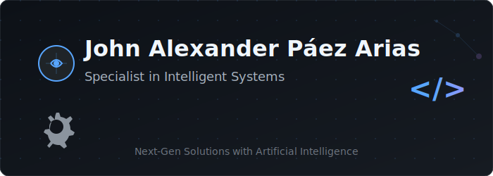
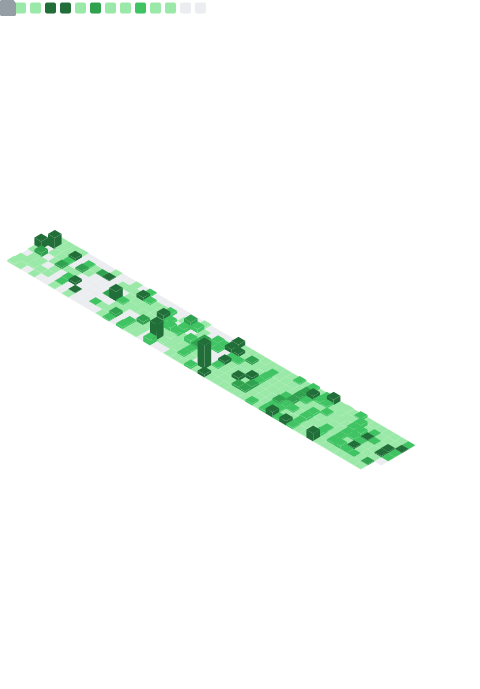

  

  
  
  
  

 

  
  
  

---

## 👨‍💻 Sobre Mí

Soy **John Alexander Páez Arias**, Specialist en Sistemas Inteligentes y Desarrollador Full Stack con enfoque en **IA Agentic**. Con más de 3 años de experiencia, construyo soluciones que cierran la brecha entre la IA avanzada y la operatividad empresarial (Logística, Agro y Educación).

---

## 🎯 Metas 2026-2027

- 🚀 **Lanzar 3 productos SaaS** con IA aplicada
- 📈 **Crecer una comunidad** de +5000 desarrolladores en IA
- 🎓 **Ayudar a 1000+ personas** a aprender IA práctica
- 🌟 **Llegar a 100k suscriptores** en YouTube (Tu Profe de IA)
- 💼 **Cerrar 10 clientes** para consultoría en IA empresarial
- ⭐ **100+ stars en GitHub** para Hive
- 🛠️ **Impulsar adopción de Hive-CLI** como herramienta de inferencia local

---

## 🧠 Enfoque Actual

- 🧠 **Agentes de IA y Sistemas Autónomos**: LangChain, LangGraph y flujos agentic.
- ⚙️ **Automatización Inteligente**: n8n, APIs y arquitecturas sin servidor.
- 🧩 **Arquitectura de Software con IA**: integración de LLMs (Gemini, GPT) en productos digitales escalables.
- 📦 **IA Aplicada a Logística y Trazabilidad**.
- 🎓 **Educación Práctica en Inteligencia Artificial**.
- 🌱 **IA para Agroemprendimientos y Economía Popular**.

---

## 🚀 Dashboard Tecnológico

| 🧠 IA & AGENTIC | 🌐 FULL STACK | 🛠️ DEVOPS & CLOUD |
| :--- | :--- | :--- |
| **Frameworks**: LangChain, LangGraph | **Runtime**: Node.js, Bun | **Infra**: Docker, Kubernetes |
| **LLMs**: Gemini SDK, OpenAI API | **Front**: React, Next.js, Vite | **Cloud**: Google Cloud, AWS |
| **Tools**: n8n, Flowise, Vector DBs | **Backend**: TypeScript, Elysia.js, Python | **DBs**: PostgreSQL, MongoDB |

  
  
  
  
  
  

---

## 🎥 Tu Profe de IA

Soy creador del canal **[Tu Profe de IA](https://www.youtube.com/@tuprofedeIA)**, donde enseño Inteligencia Artificial sin humo, 100% práctica y aplicada.

En el canal encontrarás:
- 🤖 IA aplicada a emprendimientos
- 🛠️ Creación de agentes y automatizaciones
- ✍️ Prompts avanzados y arquitectura agentic
- 🧪 Ejercicios prácticos en vivo
- ⚠️ Análisis crítico sobre riesgos y usos reales de la IA

  
<b>📅 En vivos (Hora Colombia GMT-5)</b>

  
Lunes – 6:00 PM: Creación de contenido con IA &nbsp;|&nbsp; Miércoles y Viernes – 6:00 PM: IA aplicada a negocios

---

## 🐝 Proyectos Destacados — Open Source

### [Hive](https://github.com/johpaz/hive) — Gateway de Agentes IA 🐝

  
  

> 232 Commits · 51K+ líneas de código

Gateway de IA orquestado — un enjambre de agentes especializados que trabajan juntos bajo la coordinación de un gateway central. Local-first, multi-canal, open source. Construido desde Colombia para el mundo.

| Característica | Detalle |
|----------------|---------|
| **Runtime** | Bun + SQLite |
| **Arquitectura** | Native Agent Loop (sin LangChain) |
| **Tools** | 73 nativas (navegador, filesystem, cron, Office) |
| **Skills** | 30 integradas |
| **Canales** | WebChat, Telegram, Discord |
| **Models** | Gemini, Anthropic, OpenAI, Groq, Ollama |
| **Compatibilidad** | Raspberry Pi, VPS, Docker, binario standalone |

[⭐ Ver en GitHub](https://github.com/johpaz/hive) · [🌐 hiveagents.io](https://hiveagents.io) · [💬 Discord](https://discord.gg/hive)

### [HiveLearn](https://github.com/johpaz/HiveLearn) — Aprendizaje Adaptativo 📚

  

> 29 Commits

Plataforma de aprendizaje con 16 agentes de IA especializados que generan lecciones personalizadas. Onboarding conversacional, mundo pixel art interactivo (PixiJS), gamificación.

### [Hive-CLI](https://github.com/johpaz/hive-cli) — Inferencia Local ⚡

  

> 19 Commits

CLI multimodal de llama.cpp (fork TurboQuant). Soporta texto + imagen + audio. Backends: CPU, Vulkan, CUDA, Metal. Cross-platform: Linux, macOS, Windows.

---

## 📦 Otros Proyectos

<table width="100%">
  <tr>
    <td width="50%">
      <b>🤖 <a href="https://github.com/johpaz/whatsapp-gemini-agent">whatsapp-gemini-agent</a></b> 
      Asistente inteligente para WhatsApp con Gemini SDK.
    </td>
    <td width="50%">
      <b>🧩 <a href="https://github.com/johpaz/bunElisyaAgent">bunElisyaAgent</a></b> 
      Agentes de IA de alto rendimiento con Bun y Elysia.
    </td>
  </tr>
  <tr>
    <td width="50%">
      <b>📦 <a href="https://logistica-mercantil.com.co">TSMind / Logística</a></b> 
      Trazabilidad con QR e inteligencia en logística.
    </td>
    <td width="50%">
      <b>🎓 <a href="https://tuprofedeia.com.co">Tu Profe IA Web</a></b> 
      Ecosistema educativo de IA aplicada.
    </td>
  </tr>
</table>

- **[toon-format-parser-n8n](https://github.com/johpaz/toon-format-parser-n8n)** – Nodo personalizado para n8n que procesa el formato TOON.
- **[Profinder](https://github.com/johpaz/Profinder)** – Conecta profesionales con clientes en una plataforma robusta.
- **[ArsMonitor](https://github.com/johpaz/Arsmonitor)** – App médica para monitoreo de gases arteriales en tiempo real.

---

## 📊 Mis Estadísticas y Lenguajes en GitHub

  

---

## 💻 Lenguajes Más Usados

  

---

## 📈 Actividad del Desarrollador

  <picture>
    <source media="(prefers-color-scheme: dark)" srcset="github-contribution-grid-snake-dark.svg">
    <source media="(prefers-color-scheme: light)" srcset="github-contribution-grid-snake.svg">
    
  </picture>

---

## 🤝 ¿Te Gustó Mi Trabajo? ¡Apóyame!

Tu apoyo me permite seguir creando contenido gratuito, código abierto y tutoriales prácticos.

  
  
  
  

---

## 📞 Conectemos

¿Buscas automatizar procesos o integrar IA en tu negocio? ¡Hablemos!

  <a href="mailto:johpaz252@gmail.com">📫 johpaz252@gmail.com</a> •
  <a href="https://wa.me/573102403592">💬 +57 3102403592</a> •
  <a href="https://linkedin.com/in/john-alexander-paez-arias-543b0254/">💼 LinkedIn</a> •
  <a href="https://tuprofedeia.com.co">🌐 Web</a>

 

  
    
  

