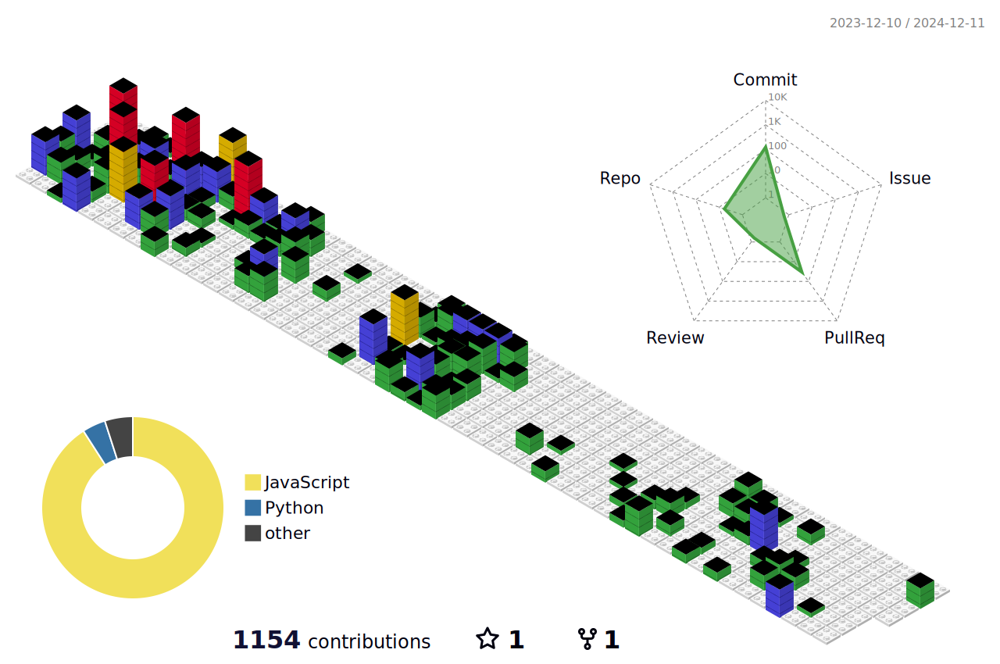

  

## 👋 Acerca de mí

Soy **John Alexander Páez Arias**, un apasionado desarrollador **Web y Móvil**, con sólida experiencia en el diseño de procesos de distribución, gestión de la cadena de abastecimiento, y optimización de operaciones. Me especializo en transformar ideas innovadoras en soluciones tecnológicas, creando aplicaciones que mejoran la eficiencia y brindan valor agregado a las empresas.

🚀 Además, comparto mis conocimientos en **programación** y **inteligencia artificial** a través de **streaming en YouTube**, donde realizo sesiones prácticas en vivo. Si quieres aprender a usar **IA para potenciar tu emprendimiento o proyecto personal**, ¡no te pierdas mis transmisiones!

## 🛠 Tecnologías y Herramientas

## 📊 Estadísticas de GitHub

  

  

## 🏆 Lenguajes más usados

  

## 🎥 **Streaming en YouTube: Tu Profe de IA**

Te invito a seguir mi canal de YouTube: **[Tu Profe de IA](https://youtube.com/c/tuprofeia)**, donde enseño sobre:
- **Inteligencia Artificial** aplicada a negocios y desarrollo.
- **Herramientas de IA** para crear contenido, imágenes, videos y más.
- **Ejercicios prácticos en vivo** sobre cómo implementar IA en tus proyectos.

### 📅 Horarios de Transmisiones en Vivo:
- **Lunes**: Creación de imagenes, videos, reel, etc con IA - 6:00 PM (Hora Colombia)
- **Miércoles y Viernes**: IA aplicada a emprendimientos - 6:00 PM (Hora Colombia)

## 🌟 Proyectos Destacados

1. **[Logística Mercantil](https://logistica-mercantil.com.co)** - App de integración de transporte
2. **[Al Instante](https://alinstante.com.co)** - App web de transporte
3. **[AgroService](https://agroservice.com.co)** - Conectando emprendedores del agro con compradores
4. **[Tu Profe de IA](https://tuprofeia.com.co)** - Plataforma de cursos interactivos de IA

## 📚 Otros Proyectos Interesantes

- **[Profinder](https://github.com/johpaz/Profinder.git)** - Plataforma para contactar profesionales y clientes.
- **[API Pokemon](https://github.com/johpaz/api-pokemon.git)** - Disfruta de cartas y contenido de tu serie favorita.
- **[ArsMonitor](https://github.com/johpaz/Arsmonitor.git)** - Aplicación móvil para monitorear gases arteriales en tiempo real. [Descargar en Google Play](https://play.google.com/store/apps/details?id=johpaz.monitor)
- **[Juego de Naves](https://github.com/johpaz/juegonaves.git)** - Juego educativo en Pygame para niños.

## 📞 Contacto

- **Email**: johpaz252@gmail.com
- **LinkedIn**: [John Alexander Páez Arias](https://www.linkedin.com/in/john-alexander-paez-arias-543b0254/)
- **Teléfono**: +57 3102403592
- **Portfolio**: [johpazdev.com.co](https://www.johpazdev.com.co/)

## 📈 Gráfico de Contribuciones en 3D

---

🎉 **Gracias por visitar mi perfil**. Espero que mis proyectos y habilidades sean de tu interés. ¡Estoy siempre abierto a nuevas oportunidades de colaboración y crecimiento en el mundo tecnológico y del streaming!